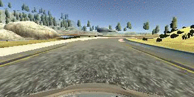
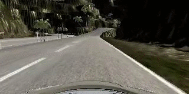

# **Behavioral Cloning** 

---

**Behavioral Cloning Project**

The goals / steps of this project are the following:
* Use the simulator to collect data of good driving behavior
* Build, a convolution neural network in Keras that predicts steering angles from images
* Train and validate the model with a training and validation set
* Test that the model successfully drives around track one without leaving the road
* Summarize the results with a written report


[//]: # (Image References)

[nvidia]: ./examples/nvidia.png "Nvidia Architecture"

## Rubric Points
### Here I will consider the [rubric points](https://review.udacity.com/#!/rubrics/432/view) individually and describe how I addressed each point in my implementation.  

---
### Files Submitted & Code Quality

#### 1. Submission includes all required files and can be used to run the simulator in autonomous mode

My project includes the following files:
* `model.py` containing the script to create and train the model
* `drive.py` for driving the car in autonomous mode
* `model.h5` containing a trained convolution neural network 
* `writeup_report.md` summarizing the results

Additionally, I have also added the following files: (These are specifically required for the second track)
* `finetune_model.py` a command line tool which simplifies the process of fine-tuning an already trained model
* `models/` directory containing models in `.h5` format which I have trained iteratively for track 2.

#### 2. Submission includes functional code
Using the Udacity provided simulator and the `drive.py` file, the car can be driven autonomously around the track by executing 
```sh
python drive.py model.h5
```

For the second track, the model can be deployed in autonomous mode on the track using
```sh
python drive.py models/model_finetuned3.h5
```
The model `model_finetuned3.h5` is the model which is capable of going through the entire round 
on track 2 (it also works on the first track).

#### 3. Submission code is usable and readable

The model.py file contains the code for training and saving the convolution neural network. The file shows the pipeline I used for training and validating the model, and it contains comments to explain how the code works.

### Model Architecture and Training Strategy

#### 1. An appropriate model architecture has been employed

I have chosen the model from the [NVIDIA paper](https://images.nvidia.com/content/tegra/automotive/images/2016/solutions/pdf/end-to-end-dl-using-px.pdf). The implementation is in Keras. 

![nvidia_architecture][nvidia]


#### 2. Attempts to reduce overfitting in the model
Although possible I did not add any mechanism against overfitting. My goal was to first see how the model performs before applying strategies to reduce overfitting.

During training, I was tracking the training and validation losses and did not actually observe that the model was overfitting. 
I concluded that from the fact that

- the validation loss finishes around the same level as the training loss
- both training and validation losses continuously decrease during training
- both losses overall quite low

Therefore, I deduced that there was no reason to apply any overfitting strategy such as dropout, batch-normalization, weight decay.

The testing also concluded that the model is running fine and that the vehicle is able to stay on track. 
More about that in later sections.

#### 3. Model parameter tuning

I used the Adam optimizer from Keras with standard hyperparameters 
    ```
    lr=0.001,
    beta_1=0.9,
    beta_2=0.999,
    epsilon=None,
    decay=0.0
    ```
I did not do any additional hyper parameter tuning as I did not find it to be necessary.

#### 4. Appropriate training data

For track no. 1 I used the dataset provided by Udacity. 

For track no. 2 I used the provided dataset augmented with images collected from my own recorded sessions for specific parts of the road. For more details see the following sections


### Model Architecture and Training Strategy

#### 1. Final Model Architecture

For my model I adopted the NVIDIA architecture. 
It consists of 5 convolutional layers with RELU activation functions
which is then flattened, followed by 5 Dense layers, also with RELU activation functions.

The only changes I have applied to the original architecture are to reflect the input image shape.
Furthermore I added a cropping Layer for cropping the unnecessary parts at the top and bottom of the image. 
Also there is a Lambda layer for normalizing the images to a [-0.5, 0.5] range using:

`pixel_value / 255 - 0.5`

This is a summary of the model. 
```
_________________________________________________________________
Layer (type)                 Output Shape              Param #   
=================================================================
lambda_1 (Lambda)            (None, 160, 320, 3)       0         
_________________________________________________________________
cropping2d_1 (Cropping2D)    (None, 65, 320, 3)        0         
_________________________________________________________________
conv2d_1 (Conv2D)            (None, 31, 158, 24)       1824      
_________________________________________________________________
conv2d_2 (Conv2D)            (None, 14, 77, 36)        21636     
_________________________________________________________________
conv2d_3 (Conv2D)            (None, 5, 37, 48)         43248     
_________________________________________________________________
conv2d_4 (Conv2D)            (None, 3, 35, 64)         27712     
_________________________________________________________________
conv2d_5 (Conv2D)            (None, 1, 33, 64)         36928     
_________________________________________________________________
flatten_1 (Flatten)          (None, 2112)              0         
_________________________________________________________________
dense_1 (Dense)              (None, 1164)              2459532   
_________________________________________________________________
dense_2 (Dense)              (None, 100)               116500    
_________________________________________________________________
dense_3 (Dense)              (None, 50)                5050      
_________________________________________________________________
dense_4 (Dense)              (None, 10)                510       
_________________________________________________________________
dense_5 (Dense)              (None, 1)                 11        
=================================================================
Total params: 2,712,951
Trainable params: 2,712,951
Non-trainable params: 0
_________________________________________________________________
```

#### 2. Creation of the Training Set & Training Process

##### Track 1

My strategy was to first establish a baseline using the Nvidia architecture as it is and to be making modifications along the way (i.e. such as modifying layers, adding mechanisms for reducing overfitting etc.) should it prove necessary. 
However it turned out that the original architecture was entirely sufficient and that there were no modifications necessary regarding the architecture.

Originally I wanted to collect my own data by driving in the simulator. However because the simulator framerate was seriously lagging, I was unable to drive even one full round without driving off track or landing in a ditch somewhere. 
Fearing that I won't be able to capture good driving behavior I decided to use the provided data as my training data.

To establish a baseline, I started with only the center images from the provided dataset. I split the data into training and validation set using a 80/20 split with random shuffling. 
Finally I defined a generator function for batch loading and trained the model using Keras' `model.fit_generator()` for 5 epochs. Since the training and validation losses were around the same level, I concluded that the model was not overfitting.

I deployed the baseline model and ran it in the simulator in autonomous mode.
This model was capable of following the majority of the road. That is until the only right turn in the track occurs upon which the car veered off the track.
I deduced that this was due to the overall left steering bias of the track (i.e. for the
majority of the road the vehicle has to steer left)

Subsequently I improved upon the model by introducing image flipping on the center images. 
I implemented this in the data loading generator function and added a check to only flip the image when the steering wheel angle is not equal to 0 (since there is no reason to flip the image when the vehicle is driving straight). 
To reflect the correct labels I also negated the steering wheel angle.
This effectively augments the training set with more samples and creates as many "right steering images" as there are "left steering images". In the end it should get rid of the left steering bias of first track. 

After introducing the image flipping the car vehicle was capable of completing the whole round in autonomous mode.

My final enhancement was to also use the left and right camera images. For these images, a steering offset of 0.3 and -0.3 was added, respectively, to the label. 
This did not result in any noticeable improvement in the driving behavior
but should be helpful for recovery reasons, i.e. to have the vehicle recover to the middle of the road should it start going off track.

The following is example of the car going through a small section of the first track


For an entire run of the first track, see the video `video.mp4`.


##### Track 2

For the first track, the approach described above was
enough to obtain a good model which lets the car drive the whole round while staying on track.

I then deployed said model in autonomous mode on the second track. 
The car immediately got stuck at the first marker post.




From this I deduced that the model is not yet generalizing to an extent that the car is able to drive around 
more prominent curves. This is most likely because the training data that the model has seen only
captures situations with mostly straight roads / small curves. It has yet to be exposed to 
situations which translate to larger steering wheel angles in order to stay on the road.

This is why I decided to use an iterative, "transfer learning" approach 
in order to improve the generalization abilities.

For this purpose I implemented a command line tool
`finetune_model.py` which allows me fine-tune an 
already trained model on newly collected images more easily, using the parameters passed from the command line.

The fine-tuning was done by loading a previously saved model and freezing
all convolutional layers by setting the `layer.trainable` parameter to `False`. 
Then I trained only the fully connected layers with a smaller learning rate (at about `10e-1`smaller than the default)
for a small number of epochs (2 to 3), upon which the model is saved.

My approach was then to run the fine-tuned model in autonomous mode, making notes along the way where the car had troubles
of passing the road. Then I switched to training mode and recorded
the data while specifically driving through those difficult sections. Subsequently I fine-tuned 
the previously trained model using the newly collected images.

The following is an example of the driving behavior after collecting more data on track 2.
The car succesfully goes through the first section, which the previous model
was unable to pass.


In the end it took three iterations of going through the second track, recording data 
of difficult situations and fine-tuning the model until the car was able to drive through the entire track in full.

For instance, this is a section of a tight left curve which the car successfully passes 


For a full recording please see the file `video_track2.mp4`.

#### 4. Further improvements

These following aspects can be improved in my opinion

- Use a more lightweight architecture; although the Nvidia model is not too complex, I have seen in former student's github repositories 
that they were able to achieve success with much simpler models
- It might be possible to train a successful model on less data. One 
idea would be to reduce the amount of images by not flipping all images, but
only a subset of based on a certain probability (e.g. flip 50% of all images)
- There are still some sections where the vehicle
veers too much to the edge of the lane, especially on the second track. One
could probably learn better driving behavior
by recording the full route, instead of only at the difficult situations.
- One could probably also achieve better results by doing more input processing, such as
converting the image to a different color space or by introducing additional image augmentation by 
changing contrast etc.

